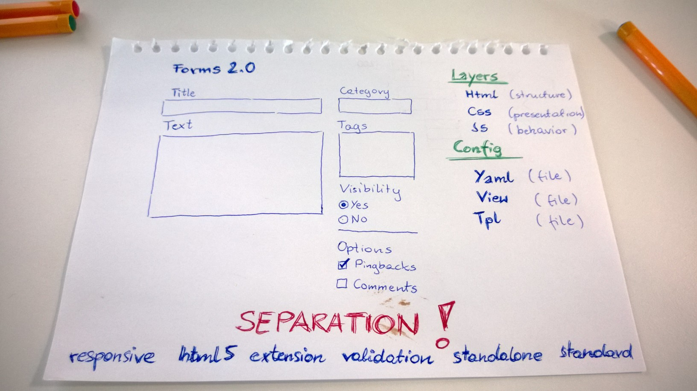
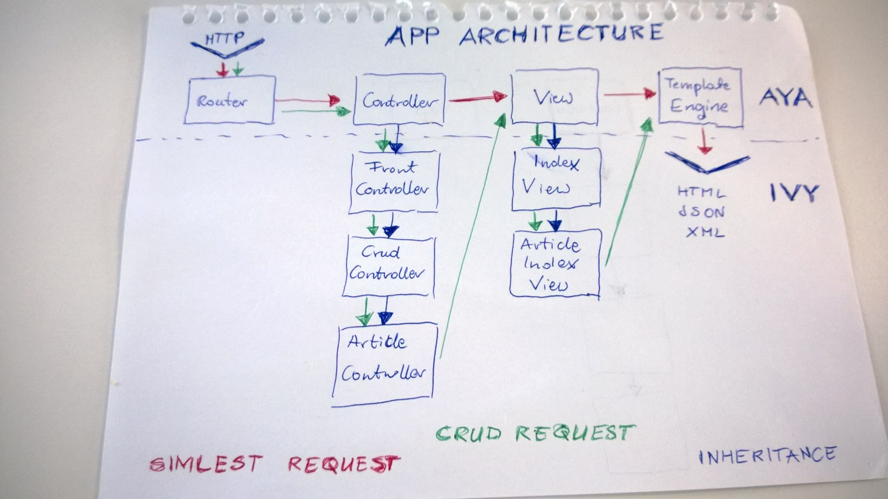

  Framework is on redesign phase. Some concepts will be changed and many code will be overridden or deleted. Stay tuned.

<!--  -->

# aya

Simple MVC framework in PHP

Trying to create simple, usable and flexible MVC framework in PHP. Individual requirements and specific workflow were the main reasons for starting development process. Many of existing PHP frameworks were created as very advanced, multi-scenarios, and comlicated pieces of code.

My intension was creating a simple, flexible and working code. Aya framework is a result of many years development experience, and software engineering paradigms.

At the begining was only chaos!

## Structure

Framework has modular structure which helps using code in other projects. Files were named...

## Modules

All files are structured for better organisation and easier maintainance. Generally module (directory) could be replaced by a new version of the code.

### Core

Main classes use to framework working, like controllers, views, and DAO abstractions. Aya framework delivers classes for general purposes and tasks.

### Management

Classes to organize CRUD functions in application.

### Html

Classes to generate Html content, like tables, forms, etc.

#### Forms

## Flow

... chart...

## Inheritance

... Controller -> FrontController -> CrudController -> ...

